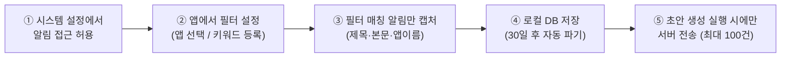
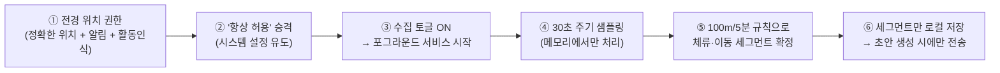

# Laimory 개인정보·위치정보 수집 현황 보고서

> 작성일: 2026-08-04 · 기준: `develop` 브랜치 실제 구현 코드
> 목적: 멘토링에서 "우리 앱이 어떤 개인정보를, 어떤 절차로 수집·저장·전송·파기하는지"를 설명하기 위한 자료.
> 본 문서는 코드에 구현된 사실을 기준으로 작성했으며, 마지막 장에 현재 한계와 개선 과제를 함께 정리했다.

---

## 1. 한눈에 보기

Laimory는 AI 라이프 로깅 앱으로, 하루의 기록(타임라인 초안)을 자동 생성하기 위해 기기 내 데이터를 수집한다. 수집·처리의 큰 원칙은 다음과 같다.

| 원칙 | 구현 내용 |
|---|---|
| **명시적 opt-in** | 모든 수집은 사용자가 권한을 허용하고 기능을 켜야 시작된다. 기본값은 "수집 안 함" |
| **수집 최소화** | 알림은 5개 필드만, 위치는 원시 좌표를 저장하지 않고 가공된 체류·이동 세그먼트만 저장 |
| **온디바이스 우선** | 수집 데이터는 로컬 Room DB에만 쌓이며, 상시 서버 업로드·백그라운드 싱크가 없다 |
| **목적 제한 전송** | 서버 전송은 사용자가 **초안 생성을 직접 실행할 때만** 발생하며, 타입별 건수 상한 적용 |
| **보존 기한** | 수집 원본은 릴리즈 기준 **30일 TTL**로 매일 자동 파기 (일일 WorkManager 정리 워커) |
| **전송 시 재최소화** | 서버로 보낼 때 로컬 필드 중 일부를 다시 제외 (예: 알림의 패키지명·수집사유) |
| **트래킹 SDK 없음** | Analytics·Crashlytics 등 제3자 분석/크래시 SDK 미탑재 (Firebase는 푸시 수신 용도만) |

### 수집하는 데이터 / 수집하지 않는 데이터

| 수집함 | 수집하지 않음 |
|---|---|
| 사진 메타데이터 + EXIF GPS 좌표 (선택한 사진만) | 연락처, SMS, 통화기록 |
| 캘린더 일정 (제목·설명·장소, 개인 소유 캘린더만) | 마이크, 카메라 직접 접근 |
| 걸음수·수면 (Health Connect) | 앱 사용 기록 (UsageStats) |
| 위치 → 체류(STAY)·이동(MOVEMENT) 세그먼트 | 브라우저 방문 기록 |
| 알림 (사용자가 지정한 앱·키워드·클릭한 것만) | 광고 식별자, 제3자 분석 이벤트 |

---

## 2. 알림 데이터 수집 절차

### 2.1 수집 정책: allowlist (기본 = 수집 안 함)

알림은 `NotificationListenerService`로 수집하지만, **바인딩되었다고 모든 알림을 저장하지 않는다.** 세 가지 조건 중 하나에 해당할 때만 수집한다 (우선순위 순).

1. **CLICK** — 사용자가 직접 탭(클릭)한 알림
2. **KEYWORD** — 사용자가 등록한 키워드가 제목+본문에 포함된 알림
3. **APP** — 사용자가 수집 대상으로 선택한 앱의 알림

어느 조건에도 해당하지 않으면 저장하지 않는다. 제목·본문이 모두 비어 있는 껍데기 알림도 저장하지 않는다. 과거 알림 소급 수집(백필)은 기술적으로 불가능하며, 서비스가 연결된 동안 발생한 알림만 대상이다.

### 2.2 수집 절차 (사용자 관점 단계)

1. **권한**: 알림 접근은 런타임 권한이 아니라 시스템 설정(`알림 접근 허용`)에서 사용자가 직접 토글해야 한다. 앱은 설정 화면으로 안내(`ACTION_NOTIFICATION_LISTENER_SETTINGS`)하고, 복귀할 때마다 허용 여부를 재확인한다.
2. **필터 설정**: 수집 화면에서 수집 대상 앱·키워드를 선택한다. 현재 수집 조건이 무엇인지 한국어 문장으로 고지한다 (예: *"앱이나 키워드를 선택하지 않아 직접 클릭한 알림만 수집하고 있어요."*).
3. **캡처**: 매칭된 알림에서 아래 5개 필드만 추출한다.
4. **저장**: 로컬 Room DB(`collection.db`)에 저장. 동일 알림 중복 저장은 유니크 키로 차단.
5. **전송**: 사용자가 타임라인 초안 생성을 실행할 때만, 해당 기록 날짜 창에 속한 알림을 최신순 최대 100건까지 전송한다.

### 2.3 수집 필드 (최소화)

| 필드 | 로컬 저장 | 서버 전송 |
|---|:---:|:---:|
| 앱 표시명 (appName) | O | O |
| 알림 제목 (title) | O | O |
| 알림 본문 (text) | O | O |
| 패키지명 (packageName) | O | **X (전송 시 제외)** |
| 수집 사유 (collectReason) | O | **X (전송 시 제외)** |
| 게시 시각 (postTime) | O | O |

**수집하지 않는 것**: 알림 아이콘, 확장 본문(bigText), 서브텍스트, 메시지 스레드, 채널 ID, 액션 버튼, PendingIntent, 그룹 정보.

- 근거: `core/collection/.../notification/LaimoryNotificationListenerService.kt`, `NotificationMapper.kt`, `core/domain/.../NotificationFilter.kt`, 전송 투영 `core/data/.../DraftSourceItemProjection.kt`

---

## 3. 위치 정보(체류·이동) 수집 절차

### 3.1 수집 정책: 원시 좌표 비영속, 세그먼트만 저장

위치 수집의 핵심 설계는 **"위치 궤적을 저장하지 않는다"**이다. 30초 주기 좌표 샘플은 메모리에서만 흐르고, 세그먼트화 규칙을 통과해 확정된 **체류(STAY)·이동(MOVEMENT) 요약만** 로컬 DB에 남는다.

- **체류(STAY)**: 반경 100m 안에서 5분 이상 머무르면 체류로 확정 → 대표 좌표(위경도) 1점 + 시작/종료 시각만 저장
- **이동(MOVEMENT)**: 체류지를 벗어나 이동 후 새 지점에 5분 이상 안착하면 이동으로 확정 → 시작·종료 좌표, 이동 거리, 이동수단(도보/차량 등)만 저장
- 좌표의 **정확도(accuracy)·고도·순간속도·방위는 아예 읽지도, 저장하지도 않는다**

이동수단은 Activity Recognition API의 활동 전환 이벤트(도보/러닝/자전거/차량)를 시간 기준으로 판정하고, 인식 실패 시 평균 속도(4m/s 기준)로 도보/차량을 추정한다. Activity Recognition은 이동수단 라벨링에만 쓰이고, 체류/이동 판정 자체는 순수하게 반경·시간 규칙으로만 이뤄진다.

### 3.2 수집 절차 (사용자 관점 단계)

1. **1단계 권한**: 정확한 위치(FINE) + 대략적 위치(COARSE) + 알림 표시(POST_NOTIFICATIONS) + 활동 인식(ACTIVITY_RECOGNITION)을 런타임 요청.
2. **2단계 권한**: 백그라운드 수집을 위한 `ACCESS_BACKGROUND_LOCATION`("항상 허용"). Android 11+는 인라인 요청이 불가하므로 앱 설정 화면으로 유도하고 복귀 시 재확인한다. "항상 허용"이 없으면 수집을 켤 수 없다.
3. **상시 고지**: 수집 중에는 포그라운드 서비스 상시 알림 *"위치 수집 중 — 체류·이동을 자동으로 기록하고 있어요"*가 항상 표시되며, 알림에서 바로 **[중지]** 할 수 있다. 이는 시스템 차원의 지속적 수집 고지 역할을 한다.
4. **샘플링**: 플랫폼 `LocationManager`(FUSED provider, API 31+)로 30초 간격 수집. 권한이 회수되거나 서비스 승격이 실패하면 스스로 토글을 끄고 종료한다.
5. **세그먼트화**: 인메모리 상태 머신이 100m/5분 규칙으로 체류·이동을 확정. 원시 샘플은 폐기.
6. **저장·전송**: 확정 세그먼트만 로컬 저장. 서버 전송은 초안 생성 시에만, **체류 최대 30건 + 이동 최대 30건** 상한으로 전송.

부가 사항:
- 재부팅 시 사용자가 켜 둔 상태였다면 부팅 리시버가 수집을 복원한다 (사용자 의도 영속).
- 클라이언트에는 리버스 지오코딩·장소명 변환이 없다. 좌표는 그대로 전송되고 장소 해석은 서버 책임이다.
- 위치정보는 위치 수집 기능 외에 **사진 EXIF GPS**로도 유입된다(`ACCESS_MEDIA_LOCATION`). 사용자가 초안에 첨부하려고 선택한 사진에 한해 좌표를 읽고 함께 전송한다.

- 근거: `core/collection/.../location/LocationCollectionService.kt`, `LocationSegmenter.kt`, `MovementTransportClassifier.kt`, `feature/collection/.../LocationPermission.kt`

---

## 4. 공통 데이터 라이프사이클 (저장 → 보존 → 전송 → 파기)

### 4.1 저장

- 모든 수집 데이터는 단일 로컬 Room DB `collection.db`의 `source_item` 테이블에 카테고리별 JSON payload로 저장된다.
- 유니크 키 `(itemType, sourceName, sourceKey)`로 멱등 저장(중복 수집 방지).
- 인증 토큰(액세스/리프레시)은 별도 DataStore에 **Android Keystore AES-GCM으로 암호화**해 저장하며, 백업 대상에서도 제외된다.

### 4.2 보존·자동 파기

- `SourceItemRetentionWorker`가 **매일 1회** 실행되어 보존 기한이 지난 수집 원본을 삭제한다.
- TTL: **릴리즈 30일 / 디버그 365일** (빌드 설정 `SOURCE_ITEM_RETENTION_DAYS`).
- 기한 계산은 캘린더 날짜 단위로, 오늘 포함 30일 이전 데이터가 삭제 대상이다.

### 4.3 서버 전송 (유일한 정기 전송 경로)

- 엔드포인트: `POST /a/api/v1/timeline/drafts` — **사용자가 홈에서 초안 생성을 실행할 때만** 호출된다. 상시 업로드·주기적 백그라운드 싱크는 없다.
- 전송 범위: 선택한 기록 날짜의 하루 창(자정~다음날 자정)에 겹치는 항목만.
- 타입별 상한: 체류 30 · 이동 30 · 일정 20 · 건강 30 · **알림 100** · 사진 20 건.
- 전송 보안: HTTPS + OAuth 2.0(PKCE, 구글/카카오) Bearer 토큰. 로깅 인터셉터는 토큰·인증 본문을 redact 처리.
- 사진 원본은 presigned URL을 발급받아 S3에 직접 업로드하고, API 요청에는 파일명·URI·EXIF 좌표만 담는다.

### 4.4 사용자 삭제 수단

| 수단 | 범위 | 상태 |
|---|---|---|
| 수집 카테고리별 일괄 삭제 (확인 다이얼로그 포함) | 로컬 수집 원본 | 구현됨 (현재 수집 화면 내) |
| 타임라인 이벤트 삭제 / 하루 기록 삭제 | 서버 기록 | 구현됨 |
| 30일 자동 파기 | 로컬 수집 원본 | 구현됨 |
| 로그아웃 | 세션·토큰 | 구현됨 (단, 로컬 수집 DB는 유지 — 개선 과제) |
| 계정 삭제(탈퇴) | 전체 | **미구현 ("준비 중")** |

---

## 5. 요청 권한 전체 목록

| 분류 | 권한 | 용도 |
|---|---|---|
| 네트워크 | INTERNET | API 통신 |
| 알림 | POST_NOTIFICATIONS | 위치 수집 상시 알림, 초안 완료 푸시 |
| 알림 수집 | BIND_NOTIFICATION_LISTENER_SERVICE (시스템 설정) | 알림 데이터 수집 |
| 위치 | ACCESS_FINE / COARSE_LOCATION, ACCESS_BACKGROUND_LOCATION | 체류·이동 수집 |
| 위치 FGS | FOREGROUND_SERVICE, FOREGROUND_SERVICE_LOCATION | 백그라운드 지속 수집 + 상시 고지 |
| 활동 인식 | ACTIVITY_RECOGNITION | 이동수단 판별, 수면 자동 감지 |
| 사진 | READ_MEDIA_IMAGES, READ_MEDIA_VISUAL_USER_SELECTED, READ_EXTERNAL_STORAGE(≤12), ACCESS_MEDIA_LOCATION | 사진 선택·EXIF 좌표 |
| 캘린더 | READ_CALENDAR | 개인 일정 수집 |
| 건강 | health.READ_STEPS, READ_SLEEP, WRITE_SLEEP, READ_HEALTH_DATA_IN_BACKGROUND | 걸음·수면 (Health Connect) |
| 부팅 | RECEIVE_BOOT_COMPLETED | 재부팅 후 수집 상태 복원 |

---

## 6. 현재 한계 및 개선 과제 (멘토링 논의 포인트)

구현된 수집 파이프라인 자체는 최소화·opt-in 원칙이 잘 잡혀 있으나, **동의·고지 레이어가 아직 비어 있다.** 우선순위 순으로 정리한다.

### A. 동의·고지 절차 (최우선)

1. **개인정보처리방침·이용약관 부재** — 설정 화면과 로그인 화면에 문구는 있으나 실제 문서·링크가 없다(클릭 불가). 방침 원문 작성과 공개(웹 URL)가 선행 과제.
2. **위치정보 별도 동의 부재** — 로그인 시 "동의 간주" 문구만 있고 체크박스·동의 기록이 없다. 위치정보법은 개인위치정보 수집·이용·제공에 대해 **이용약관 고지 + 별도 동의**(제18조)를 요구하며, 위반 시 5년 이하 징역 또는 5천만원 이하 벌금 대상이다(제39조).
3. **위치기반서비스사업 신고 필요** — Laimory처럼 단말에서 개인위치정보를 수집해 자기 서비스에 이용하는 앱은 위치정보법상 **위치기반서비스사업자**에 해당하여 방송미디어통신위원회 **신고**(제9조) 대상이다(위치정보사업 "등록"은 위치정보를 수집해 타 사업자에게 제공하는 사업자용이라 해당 없음). 소상공인·1인 창조기업은 신고 없이 개시할 수 있으나 **개시일부터 1개월 이내 간이신고**(상호·소재지·사업 종류)를 해야 한다(제9조의2). 미신고 영업은 3년 이하 징역 또는 3천만원 이하 벌금(제40조). 접수는 전자민원센터(emsit.go.kr), 실무 안내는 KISA 위치정보지원센터(lbsc.kr).
4. **온보딩·권한 rationale 화면 없음** — 현재 위치·알림·캘린더·건강 권한 요청 UI는 개발용 "수집 실험실" 화면(정식 내비게이션 미노출)에만 있다. 정식 사용자 동선에 "무엇을 왜 수집하는지" 설명 후 권한을 요청하는 온보딩이 필요하다.

### B. 수집 기본값·통제권

5. **알림 클릭 수집이 기본 ON** — 필터를 하나도 설정하지 않아도 사용자가 탭한 알림은 수집된다. 화면에 고지는 되지만 **끄는 토글이 없다.** opt-in 원칙에 맞게 기본 OFF 또는 토글 제공 검토.
6. **로그아웃 시 로컬 수집 DB 미삭제** — 세션만 지워지고 알림 본문·위치 세그먼트는 기기에 남는다. 공용 기기 시나리오에서 문제.
7. **계정 삭제(탈퇴) 미구현** — 삭제권(개인정보 보호법상 파기 요구) 대응을 위해 서버 API 포함 구현 필요.

### C. 저장·전송 보안

8. **로컬 DB 평문 저장** — 알림 본문·위치 좌표·일정 내용이 암호화 없는 SQLite에 저장된다. 또한 `allowBackup="true"` 상태에서 `collection.db`가 클라우드 백업 제외 목록에 빠져 있어 기기 백업에 포함된다. SQLCipher 도입 또는 최소한 백업 제외 등록 필요.
9. **디버그용 Google Drive 내보내기 잔존** — 테스트용 수집 데이터 Drive 업로드 코드(`DriveTestExporter`)가 남아 있다(자격증명 없으면 미동작, 삭제 예정 주석 있음). 릴리즈 전 제거 확인 필요.

### D. 품질(개인정보 관점 부수 효과)

10. **위치 정확도 필터 부재** — accuracy를 읽지 않아 저품질 좌표가 체류 판정을 흔들 수 있고, 부정확한 위치가 그대로 서버에 전송될 수 있다.
11. **종료 시 열린 세그먼트 유실 가능** — 프로세스 강제 종료 시 진행 중이던 체류/이동이 flush되지 못할 수 있다.

---

## 부록: 주요 근거 코드 위치

| 영역 | 파일 |
|---|---|
| 알림 수집 서비스 | `core/collection/src/main/java/.../notification/LaimoryNotificationListenerService.kt` |
| 알림 필드 매핑 | `core/collection/src/main/java/.../notification/NotificationMapper.kt` |
| 알림 필터 정책 | `core/domain/src/main/java/.../model/collection/NotificationFilter.kt` |
| 위치 수집 서비스 (FGS) | `core/collection/src/main/java/.../location/LocationCollectionService.kt` |
| 체류·이동 세그먼트화 | `core/collection/src/main/java/.../location/LocationSegmenter.kt` (100m / 5분) |
| 이동수단 분류 | `core/collection/src/main/java/.../location/MovementTransportClassifier.kt` |
| 위치 권한 정의 | `feature/collection/src/main/java/.../screen/LocationPermission.kt` |
| 로컬 DB | `core/collection/src/main/java/.../database/CollectionDatabase.kt` (`collection.db` / `source_item`) |
| 보존 정책·워커 | `app/src/main/java/.../retention/SourceItemRetentionWorker.kt`, `core/domain/.../SourceItemRetentionPolicy.kt` |
| 서버 전송 API | `core/data/src/main/java/.../network/api/TimelineDraftApi.kt` (`POST timeline/drafts`) |
| 전송 필드 투영(최소화) | `core/data/src/main/java/.../model/timeline/request/DraftSourceItemProjection.kt` |
| 전송 상한 | `core/domain/src/main/java/.../model/timeline/DraftSourceItemSelectionPolicy.kt` |
| 매니페스트 권한 | `core/collection/src/main/AndroidManifest.xml`, `app/src/main/AndroidManifest.xml` |
